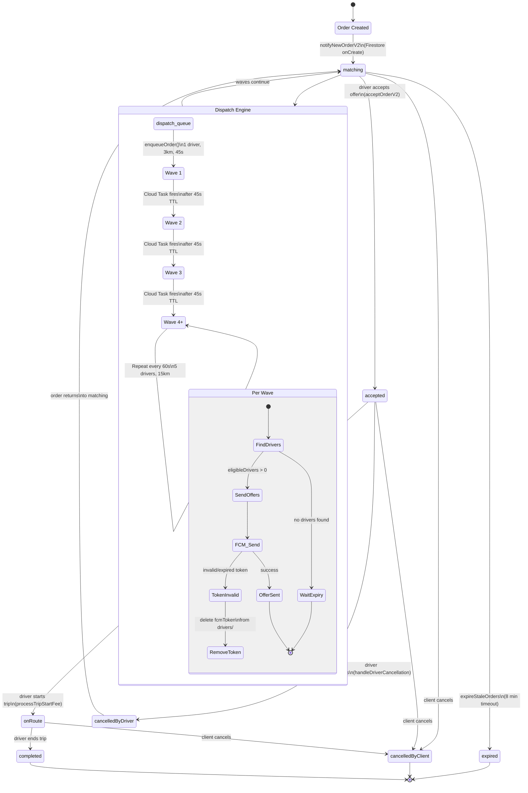
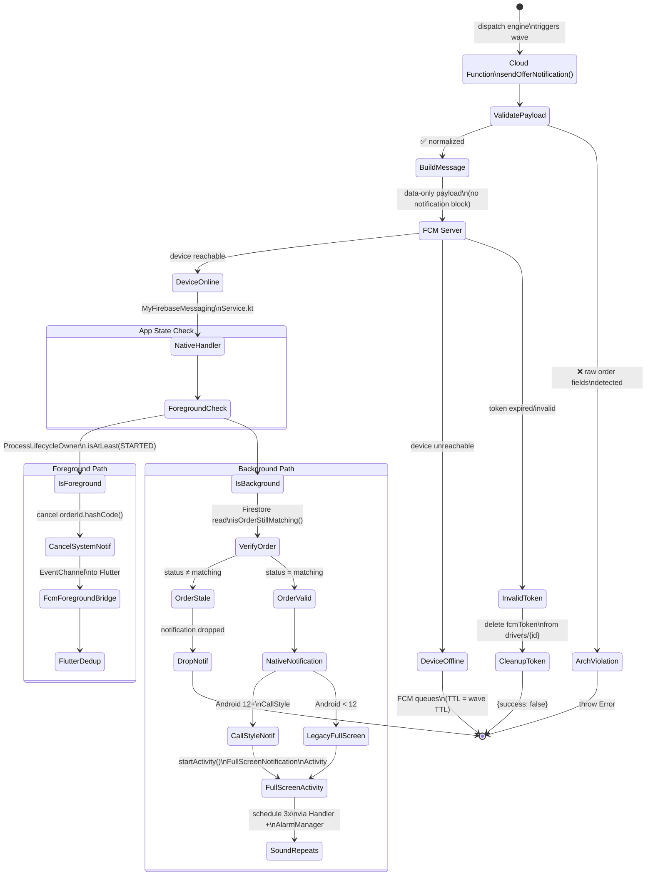
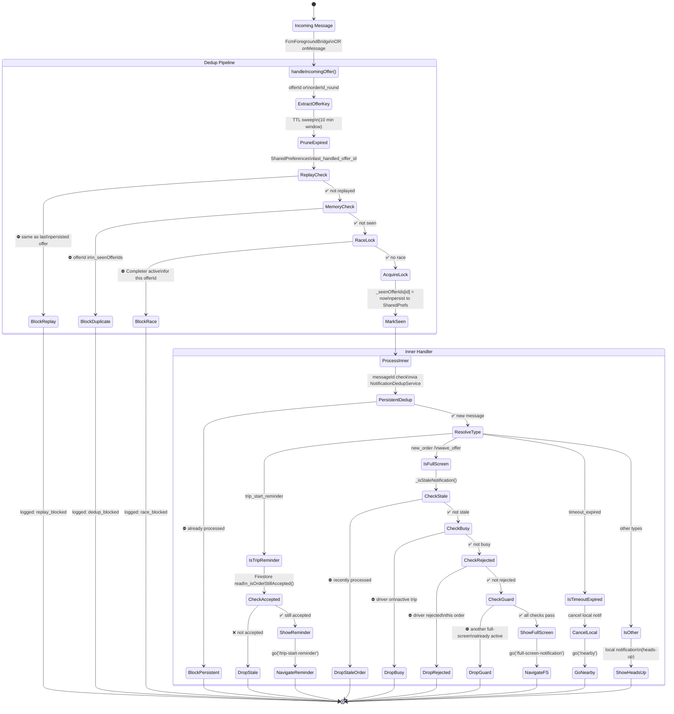
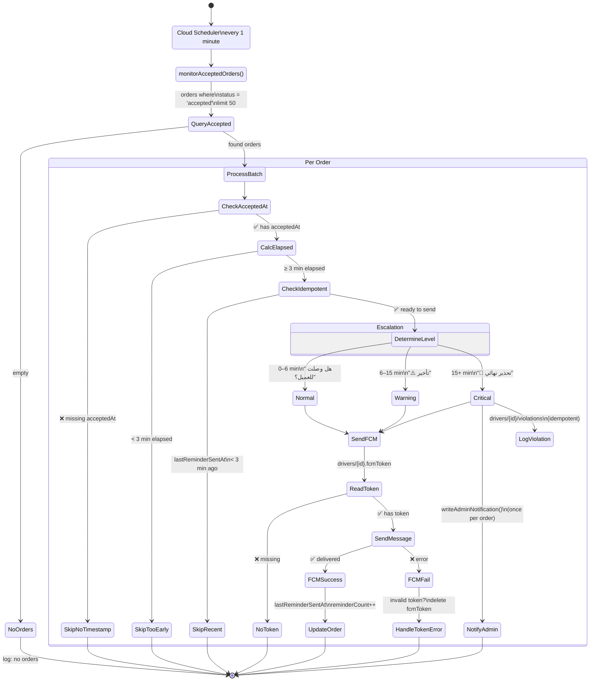
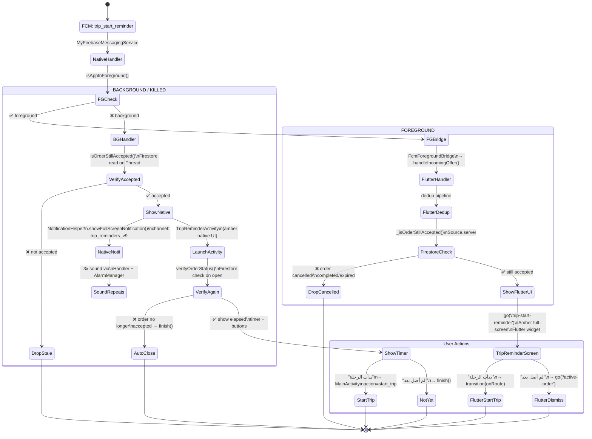
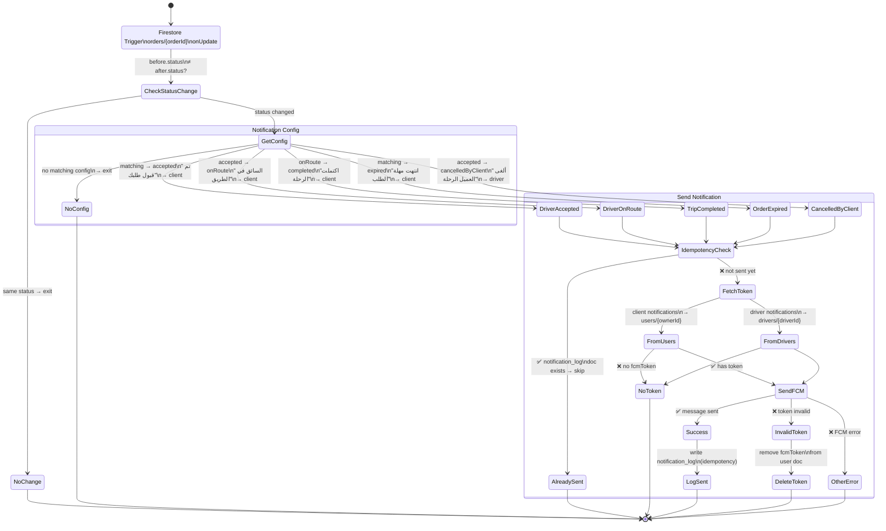
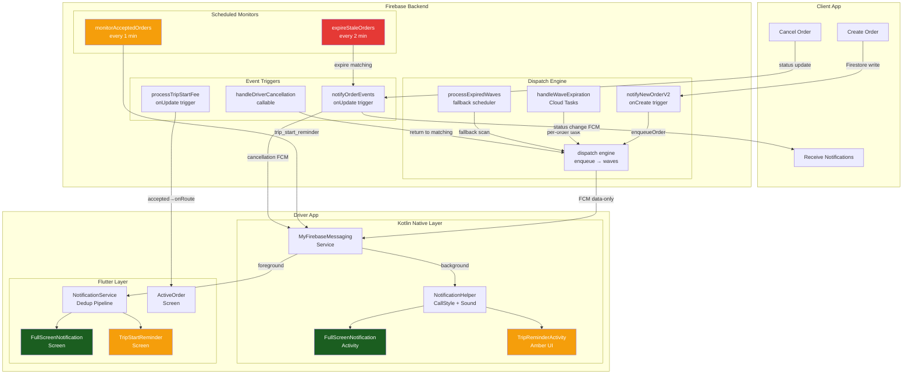

# WawApp Notification System — State Diagrams

## 1. Order Lifecycle & Dispatch Waves



## 2. FCM Delivery Pipeline (New Order)



## 3. Flutter Foreground Dedup Pipeline



## 4. Trip Start Reminder (monitorAcceptedOrders)



## 5. Trip Reminder Delivery (Foreground vs Background)



## 6. Order Status Change Notifications (notifyOrderEvents)



## 7. Expiration & Cleanup

```mermaid
stateDiagram-v2
    direction TB

    state "Cloud Scheduler\nevery 2 minutes" as Scheduler
    state "expireStaleOrders()" as Expire

    [*] --> Scheduler
    Scheduler --> Expire

    Expire --> QueryStale : orders where\nstatus = matching\nassignedDriverId = null\ncreatedAt < now - 8min

    QueryStale --> NoStale : empty → exit
    QueryStale --> BatchExpire : found stale orders

    BatchExpire --> UpdateStatus : status → 'expired'\nexpiredAt → now

    UpdateStatus --> NotifyClient : FCM to client\n"لا يوجد سائق متاح"
    UpdateStatus --> AdminNotif : writeAdminNotification()\n"طلب منتهي الصلاحية"

    NotifyClient --> ClientHasToken : ✅ send FCM
    NotifyClient --> ClientNoToken : ❌ no token → skip

    state "Dispatch Cleanup" as Cleanup {
        note left of Cleanup
            processExpiredWavesForOrder()
            checks order status before
            each wave. If not 'matching',
            removes from dispatch_queue.
        end note
    }

    NoStale --> [*]
    ClientHasToken --> [*]
    ClientNoToken --> [*]
    AdminNotif --> [*]
```

## 8. Full System Overview



---

## Legend

| Color | Meaning |
|-------|---------|
| 🟢 Green (#1B5E20) | New order full-screen (accept/reject) |
| 🟠 Amber (#F59E0B) | Trip start reminder (warning) |
| 🔴 Red (#E53935) | Expiration / cancellation |

## Key Failure Paths

| Failure | Guard | Recovery |
|---------|-------|----------|
| FCM token invalid/expired | Catch `messaging/invalid-registration-token` | Delete token from Firestore |
| Order cancelled during wave | `isOrderStillMatching()` check before notification | Drop notification silently |
| Trip reminder after cancellation | `_isOrderStillAccepted()` (Flutter) + `verifyOrderStatus()` (Kotlin) | Auto-close / don't navigate |
| Duplicate FCM delivery | 5-layer dedup: offerId TTL → replay → memory → race lock → persistent | Block at first matching layer |
| Wave stuck in 'sending' | `waveStatus` guard + fallback scheduler | Next scheduler run resets to 'idle' |
| Cloud Task fails to fire | `processExpiredWaves` runs every 2 min as fallback | Catches orphaned waves |
| Driver on active trip | `_isDriverOnActiveTrip()` Firestore check | Skip new order notification |
| Circuit breaker tripped | 3 consecutive failures per order / 10 global in 1 min | Move to `dispatch_stuck_orders` / pause 30s |
